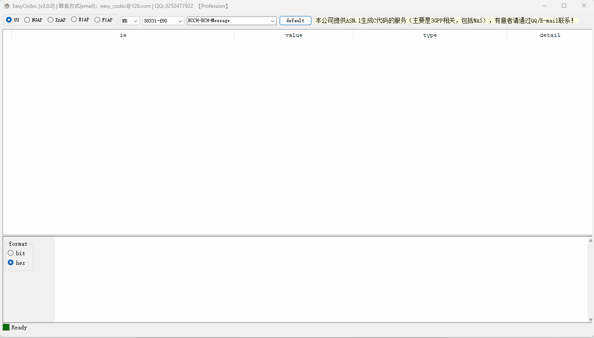
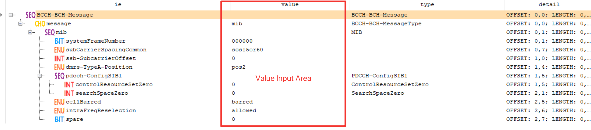
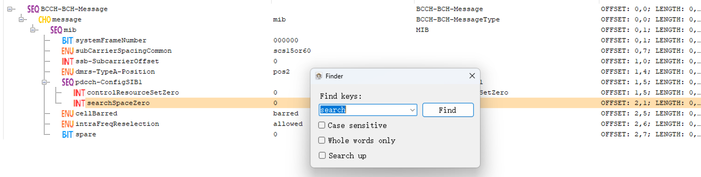
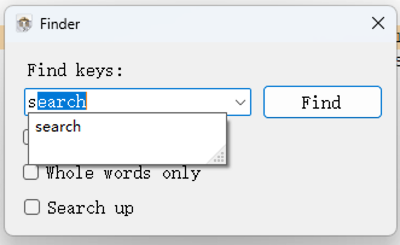

# asn.1 tool

## Description
Decode 4G/5G message stream, including access layer messages from terminals and base stations.

## Contact Information

If you have any cooperation needs or technical issues, please contact us via email: easy_codec@126.com

## Installation Tutorial

Currently, the tool only supports Windows systems.

Click on EasyCodec.msi to install directly.

## Instructions for use

It is a tool with encoding and decoding capabilities, covering multiple interface messages between base stations and terminals. It is also an encoding and decoding analysis tool, through which you can clearly understand the meaning represented by each bit of the bitstream.

## Operation effect

Let's take a look at the operation of this tool to give everyone a visual experience.

## Protocol Support

The tool supports encoding and decoding of protocol messages such as 3GPP air port, F1AP, NGAP, E1AP, XNAP, etc.

## Easy to understand IE types

Each IE will have an icon that identifies the ANS.1 type of each IE. The specific meaning of the icon is as follows:

-   boolean type
-   choice type
-   enumerated type
-   integer type
-   numericString type
-   null type
-   object identifier type
-   octetstring type
-   open type
-   printable string type
-   real type
-   sequence type
-   sequence of type
-   set type
-   visible string type
-   bitstring type

## Convenient and fast input method

The second column of the element display area allows for different types of values to be entered, and the way numerical values are entered may vary depending on the type of ASN. 1.

Before entering, you need to select the corresponding IE row and then click on the corresponding IE row in the input area to input. Pressing the enter key or clicking the mouse on an area outside the "value input area" will take effect when entering the value.

## Powerful search function

Supports various search functions, and can automatically match and complete historical keywords when entering them. As follows:

