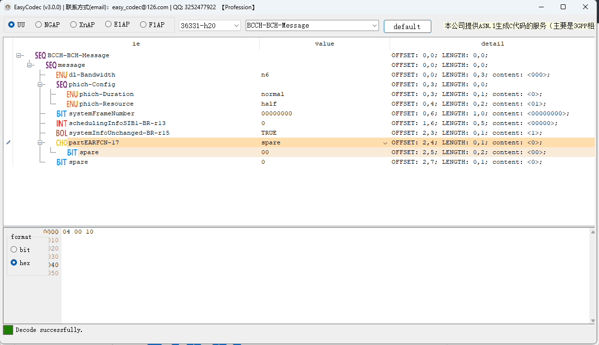
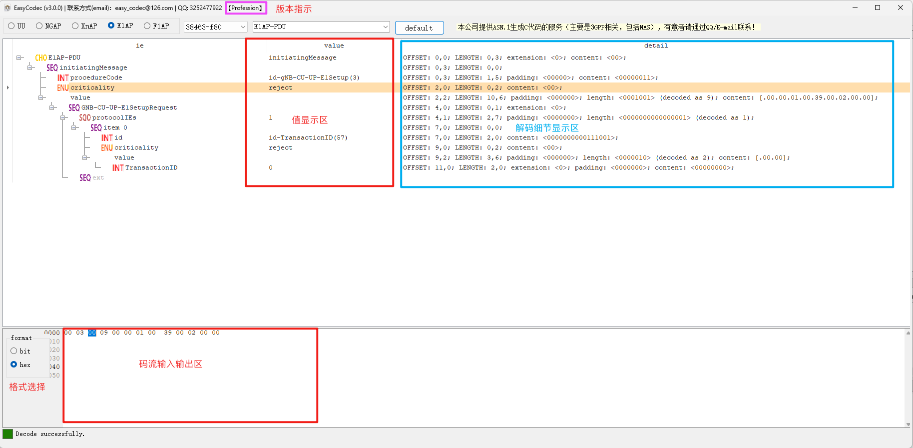
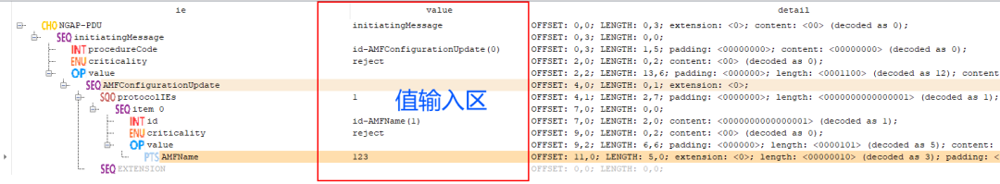
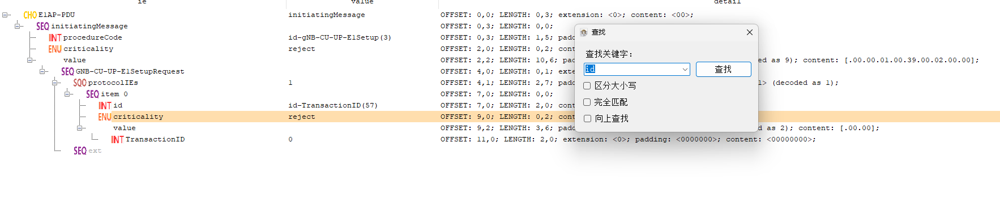
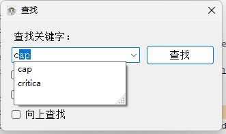

# asn.1 tool

## 介绍
解码4G、5G消息码流，包括终端和基站的接入层消息。

## 联系方式
有合作需求或者技术上的问题，请邮件联系：easy_codec@126.com

## 安装教程

目前工具只支持Windows系统。

点击EasyCodec.msi直接安装。

## 使用说明

它是一款具有编码和解码的工具，它是一款覆盖基站和终端多种接口消息的编码和解码工具，它还是一款编码和解码分析工具，通过它，你可以清晰的了解码流的每一位代表的含义。

## 操作效果

先看一下这个工具的操作，给大家一个直观感受。

## **界面功能划分**

界面功能划分如下图所示：

## **广泛的协议支持**

工具支持3GPP空口，F1AP，NGAP，E1AP，XNAP等协议消息的编解码。

## **一目了然的IE类型**

每条IE都会有一个图标，标识每个IE的ANS.1类型，具体的图标含义如下：

-   boolean类型
-   choice类型
-   enumerated类型
-   integer类型
-   numericString类型
-   null类型
-   object identifier类型
-   octetstring类型
-   open type类型
-   printable string类型
-   real类型
-   sequence类型
-   sequence of类型
-   set类型
-   visible string类型
-   bitstring类型

## **方便快捷的输入方式**

元素显示区的第二列可以输入不同类型的值，根据ASN.1的类型不同，输入数值的方式会有些差异。

在输入前，需要选中对应的IE行，然后再点击输入区对应的IE行，即可输入。敲击回车键或者鼠标点击“值输入区”以外的区域，输入值生效。

## **强大的搜索功能**

支持各种查找功能，并且在输入关键字的时候可以对历史关键字进行自动匹配和补齐。如下：

